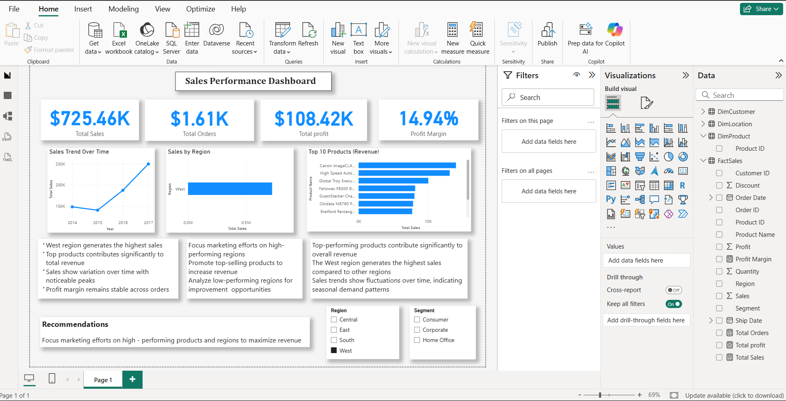

# sales-performance-dashboard
Power BI dashboard analyzing sales, profit, and regional performance
# Sales Performance Dashboard

## Overview
This project presents an interactive Power BI dashboard analyzing sales performance, profitability, and regional trends.

## Key Metrics
- Total Sales: $725K  
- Total Orders: 1.61K  
- Total Profit: $108K  
- Profit Margin: 14.94%

## Key Insights
- West region generates the highest sales  
- Top products contribute significantly to revenue  
- Sales trends show fluctuations over time  
- Profit margin remains stable  

## Tools Used
- Power BI  
- Power Query  
- DAX  
- Excel  

## Dashboard Preview

